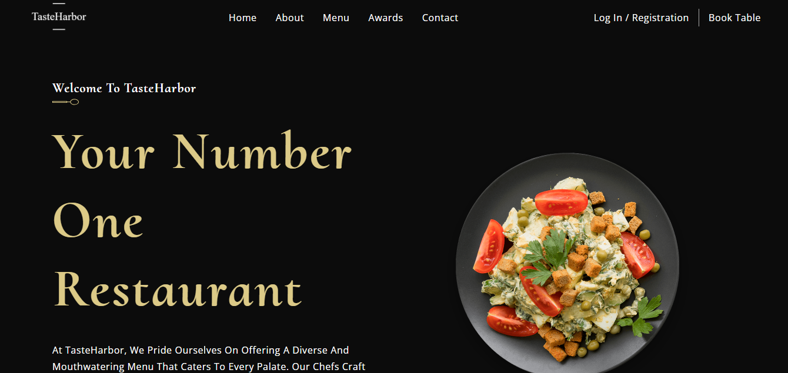

# TateHarbor Restaurant Website

TasteHarbor is a fictional restaurant website project aimed at showcasing the restaurant's menu, services, and facilitating online inquiries or reservations. This project serves as a demonstration of frontend web development skills, focusing on creating an intuitive and visually appealing user interface for a restaurant website.

Deployed Site: [TasteHarbor Restaurant Website](https://tasteharbor-restaurant.netlify.app)

Final Project Blog Article: [Medium.com](https://medium.com/@joanotieno1998/tasteharbor-restaurant-website-6c6738ee122a)

Author's LinkedIn: [Joan Otieno](https://www.linkedin.com/in/joan-achieng-869337190/)

## Inspiration and Technical Challenge

The motivation behind the TasteHarbor project was twofold: to showcase my frontend development skills and to create a digital platform that captures the essence of dining at TasteHarbor. I envisioned a website that not only presents the restaurant's menu and services but also evokes the ambiance and flavors of the dining experience.

One of the main technical challenges I encountered was finding the balance between aesthetics and functionality. I wanted the website to be visually stunning while ensuring seamless navigation and user interaction. Choosing the right design elements, color schemes, and layout structures proved to be a delicate yet rewarding process.

## Struggles and Next Iteration

Throughout the development process, I encountered various challenges, from implementing responsive design to optimizing performance for different devices and screen sizes. There were moments of frustration and doubt, but each hurdle became an opportunity for growth and learning.

In the next iteration of the TasteHarbor project, I envision incorporating more interactive features, such as live chat support for reservations and integrating third-party APIs for real-time order tracking. I also plan to incorporate backend infrastructure to support dynamic content management and personalization for users.

## Timeline and Reflection

The journey of creating the TasteHarbor Restaurant Website has been a labor of love, spanning weeks of planning, designing, and coding. From the initial concept sketches to the final deployment, every step of the process has been a testament to perseverance and creativity.

As I reflect on this project, I am reminded of the human behind the keyboard—a passionate developer driven by a desire to create meaningful experiences. While the TasteHarbor project may not be the most technically impressive application, it represents a journey of growth, resilience, and the relentless pursuit of excellence.

## Installation

To run this project locally, follow these steps:
* Clone the repository: `git clone https://github.com/Joan254/tasteharbor.git`
* Navigate to the project directory: `cd tasteharbor`
* Install dependencies: `npm install`
* Start the development server: `npm start`
* Open your browser and visit `http://localhost:3000`

## Usage

* Browse the menu to explore various offerings.
* Contact the retaurant for inquiries or reservations.

## Contributing

Contributions are welcome! If you would like to contribute to this project, please follow these steps:
* Fork the repository.
* Create a new branch for your feature: `git checkout -b feature-name`
* Make your changes and commit them: `git commit -m 'Add some feature'`
* Push to the branch: `git push origin feature-name`
* Submit a pull request.

## Screenshot

## Licensing

Public Domain. No copy write protection.

## Available Scripts

In the project directory, you can run:

### `npm start`

Runs the app in the development mode.\
Open [http://localhost:3000](http://localhost:3000) to view it in your browser.

The page will reload when you make changes.\
You may also see any lint errors in the console.

### `npm test`

Launches the test runner in the interactive watch mode.\
See the section about [running tests](https://facebook.github.io/create-react-app/docs/running-tests) for more information.

### `npm run build`

Builds the app for production to the `build` folder.\
It correctly bundles React in production mode and optimizes the build for the best performance.

The build is minified and the filenames include the hashes.\
Your app is ready to be deployed!

See the section about [deployment](https://facebook.github.io/create-react-app/docs/deployment) for more information.

### `npm run eject`

**Note: this is a one-way operation. Once you `eject`, you can't go back!**

If you aren't satisfied with the build tool and configuration choices, you can `eject` at any time. This command will remove the single build dependency from your project.

Instead, it will copy all the configuration files and the transitive dependencies (webpack, Babel, ESLint, etc) right into your project so you have full control over them. All of the commands except `eject` will still work, but they will point to the copied scripts so you can tweak them. At this point you're on your own.

You don't have to ever use `eject`. The curated feature set is suitable for small and middle deployments, and you shouldn't feel obligated to use this feature. However we understand that this tool wouldn't be useful if you couldn't customize it when you are ready for it.

## Learn More

You can learn more in the [Create React App documentation](https://facebook.github.io/create-react-app/docs/getting-started).

To learn React, check out the [React documentation](https://reactjs.org/).

### Code Splitting

This section has moved here: [https://facebook.github.io/create-react-app/docs/code-splitting](https://facebook.github.io/create-react-app/docs/code-splitting)

### Analyzing the Bundle Size

This section has moved here: [https://facebook.github.io/create-react-app/docs/analyzing-the-bundle-size](https://facebook.github.io/create-react-app/docs/analyzing-the-bundle-size)

### Making a Progressive Web App

This section has moved here: [https://facebook.github.io/create-react-app/docs/making-a-progressive-web-app](https://facebook.github.io/create-react-app/docs/making-a-progressive-web-app)

### Advanced Configuration

This section has moved here: [https://facebook.github.io/create-react-app/docs/advanced-configuration](https://facebook.github.io/create-react-app/docs/advanced-configuration)

### Deployment

This section has moved here: [https://facebook.github.io/create-react-app/docs/deployment](https://facebook.github.io/create-react-app/docs/deployment)

### `npm run build` fails to minify

This section has moved here: [https://facebook.github.io/create-react-app/docs/troubleshooting#npm-run-build-fails-to-minify](https://facebook.github.io/create-react-app/docs/troubleshooting#npm-run-build-fails-to-minify)
